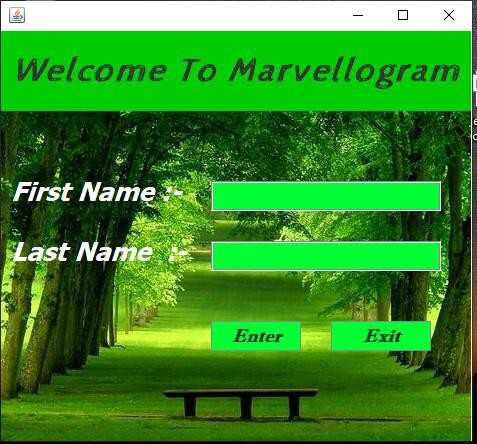
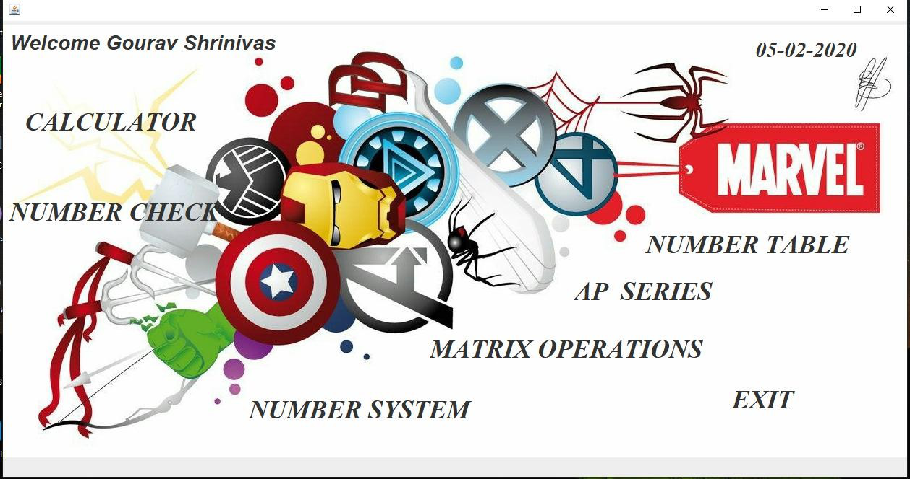
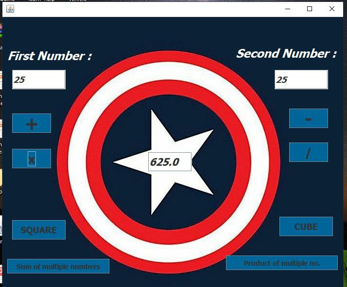
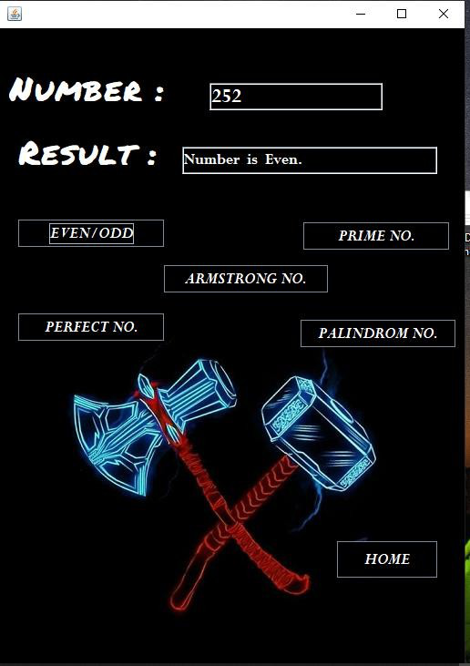
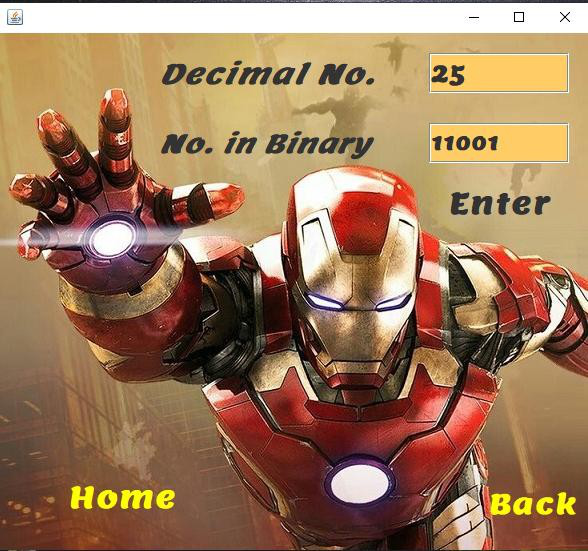
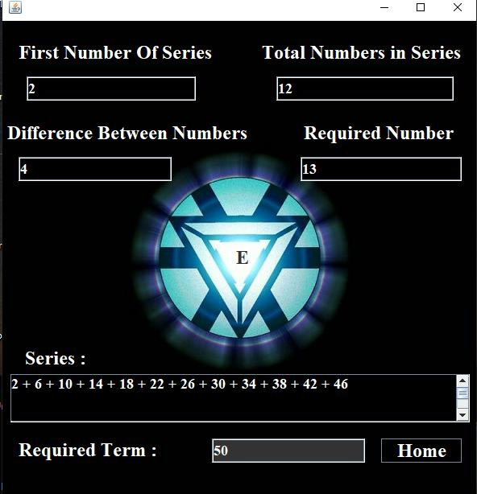
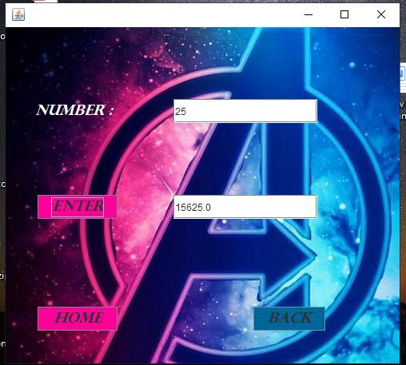
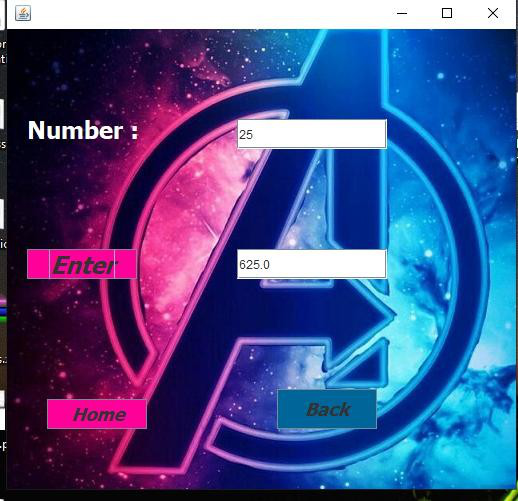
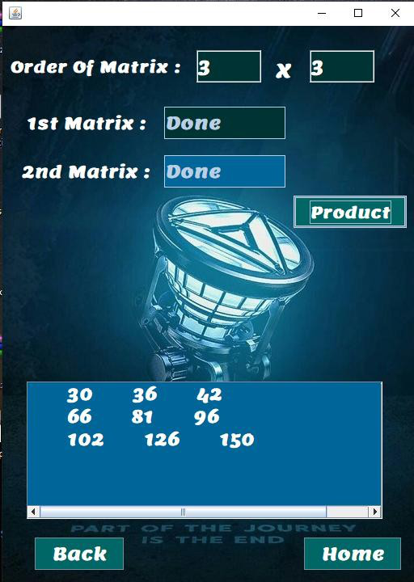

# Marvellogram

Marvellogram is a java desktop application. This application is used to solve normal mathematics problems, in simple words we can say that it is the combinations of basic coding programs.

## Some of the Screenshots of the application :-

.png)

